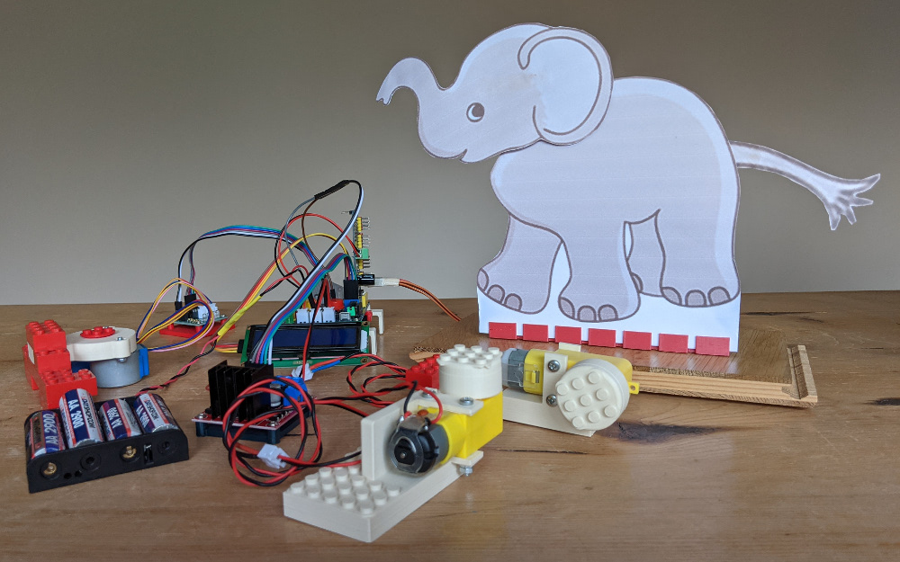

# Raspberry Pi Maker PCB controlled mechatronic builds
## Documentation, example code and related data/image files to support mechatronic builds.

 &nbsp; &nbsp; 

The word ‘mechatronic’ is used to mean any object where the movement, and any associated sound generation, is managed by a computer such as a Raspberry Pi. The object could be anything from a simple 2D animal outline (sometimes called an ‘animatronic’) through to a complex 3D Lego structure.

Full details about the project are published at <a href="https://onlinedevices.org.uk/RPi+Maker+PCB+-+Mechatronic+projects" target="_blank" >this link</a> and the designs for a range of associated custom 3D printed components can be downloaded from <a href="https://www.prusaprinters.org/prints/137215-servo-motor-framework-connectors" target="_blank">here, </a><a href="https://www.prusaprinters.org/prints/71626-stepper-motor-and-controller-lego-duplo-connectors" target="_blank">here, </a><a href="https://www.prusaprinters.org/prints/71561-servo-motor-and-pwm-controller-lego-connectors" target="_blank">and here</a>.

The version 1.1 set of code and related material, provided here for a Raspberry Pi single board computer (SBC) connected to a Maker PCB, is for mechatronic builds that use servo, stepper and drive motors. The version 1.1 update is to allow for a generalised username instead of the previous default username 'pi'.

A constraint for the current versions is that each build can only use one type of motor. A future version of the overall system aims to support mechatronic builds that can use a mix of motor types.

The main Python code is assumed to be in the user's default file space i.e. /home/YOURUSERNAME/ and then in a subfolder structure /RPi_maker_kit5/mechatronics/.

The code uses a Flask web server and associated HTML templates to provide a browser-based interface for all the functionality. To support fast servo operations, custom 'C' functions are used that are underpinned by an installed libPCA9685 library (see https://github.com/edlins/libPCA9685 for details). 

The supplied custom libpicontrol_servo.so was compiled on a Raspberry Pi 4 - so may need to be recompiled for a different SBC. The compilation command used is as follows:

gcc -shared -o /home/YOURUSERNAME/RPi_maker_kit5/mechatronics/libpicontrol_servo.so -fPIC /home/YOURUSERNAME/RPi_maker_kit5/mechatronics/picontrol_servo.c -I/usr/local/include -L/usr/local/lib -lPCA9685

